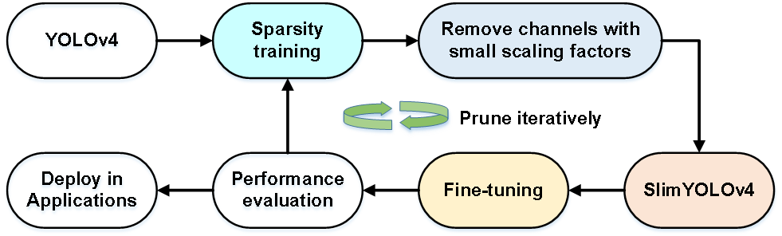

# Object Detection

[](https://dev.azure.com/Adlik/GitHub/_build/latest?definitionId=3&branchName=main)
[](https://app.bors.tech/repositories/33433)

## 1. Introduction

Adlik object_detection mainly studies the real-time and high-precision object detection algorithms,  
and performs model compression and acceleration, so that they can be deployed on different  
platforms and devices and achieve real-time performance.

At present, we mainly implement the training and model compression of the YOLOv4。
In the future, we will continue to explore real-time yolov4 methods that can maintain
high accuracy on different hardware devices.

## 2. Update

2020.03.24

- YOLOv4 training that supports single-node or multi-node multi-GPU and mixed precision training.
- Pruning that supports regular pruning.
- Knowledge Distillation.

## 3. Enviroment

We recommend using Docker and have provided dockerfile files.

If you need to install it yourself, you need pytorch>=1.6 , python >=3.6 that uses CUDA 10.1.

- Create a python virtual environment and install the dependent packages.

```shell
pip install -r requirements.txt
```

- Clone the Adlik object detection code repository from github.

```shell
git clone https://github.com/Adlik/Adlik_object_detection.git
```

## 4. Training

Run commands below to reproduce results on COCO dataset or custom dataset.

- Single node multi-gpu (e.g. 8 gpu)

```shell
python -m torch.distributed.launch --nproc_per_node=8 train.py --cfg cfg/yolov4.cfg --data data/coco2017.yaml 
--weights weights/yolov4.conv.137 --epochs 200 --batch_size 4 --multi-scale
```

- multi node multi-gpu (e.g. 2 nodes and 8 gpu)

```shell
python -m torch.distributed.launch --nproc_per_node=8 --nnodes=2 --node_rank=0 --master_addr="master node ip" 
--master_port=11122 train.py --cfg cfg/yolov4.cfg --data data/coco2017.yaml --weights weights/yolov4.conv.137 
--epochs 200 --batch_size 6 --multi-scale

python -m torch.distributed.launch --nproc_per_node=8 --nnodes=2 --node_rank=1 --master_addr="master node ip" 
--master_port=11122 train.py --cfg cfg/yolov4.cfg --data data/coco2017.yaml --weights weights/yolov4.conv.137 
--epochs 200 --batch_size 6 --multi-scale
```

## 5. Model Compression

We will explore different model compression methods to enable real-time inference of models on different hardware platforms.

### 5.1 Pruning



Regular pruning adopts the pruning method of network slimming, which is designed
for hardware deployment. The number of filters after pruning is a multiple of 8.

- Sparse training

```-st``` means start sparse training.  
```-pf``` specifies the value of the penalty factor.  

```shell
python -m torch.distributed.launch --nproc_per_node=8 train.py --cfg cfg/yolov4.cfg 
--data data/coco2017.yaml --weights weights/yolov4_last.pt --epochs 100 --batch_size 6 
-st -pf 0.0001
```

- Regular pruning

```--percent```specifies the percentage of the number of pruned channels.

```shell
python regular_prune.py --cfg cfg/yolov4.cfg --data data/coco2017.yaml 
--weights weights/sparsity_last.pt --percent 0.3 --img_size 608
```

- Fine-tuning

```shell
python -m torch.distributed.launch --nproc_per_node=8 train.py --cfg cfg/prune_0.3_yolov4.cfg 
--data data/coco2017.yaml --weights weights/prune_0.3_sparsity_last.weights 
--batch_size 8 --epochs 100
```

### 5.2 Knowledge Distillation

If the precision of the model after fine-tuning pruning decreases more, we can take the  
initial training network as the teacher network, and distill the knowledge of the pruned  
network as the student network, so as to improve the precision of the model after pruning.

```shell
python -m torch.distributed.launch --nproc_per_node=8 train.py --cfg cfg/prune_0.3_yolov4.cfg 
--teacher_cfg cfg/yolov4.cfg --data data/coco2017.yaml --weights weights/prune_0.3_sparsity_last.weights 
--teacher_weights weights/yolov4_last.pt --batch_size 8 --epochs 100
```

## 6. Test results

### 6.1 COCO dataset

All the results are tested on val2017 dataset.

|         Model          | size | mAP@0.5 | AP@0.5:0.95 | GFLOPs | params | FPS(V100) |
| ---------------------- | :--: | :-----: | :---------: | :----: | :----: | :-------: |
| YOLOv4                 | 608  |  0.664  |    0.427    | 128.7  | 246 M  |    53     |
| Sparsity YOLOv4        | 608  |  0.647  |    0.419    | 128.7  | 246 M  |    53     |
| Regular prune   (30%)  | 608  |  0.015  |      -      |  92.8  |  136M  |    63     |
| Knowledge distillation | 608  |  0.614  |    0.360    |  92.8  |  136M  |    63     |
